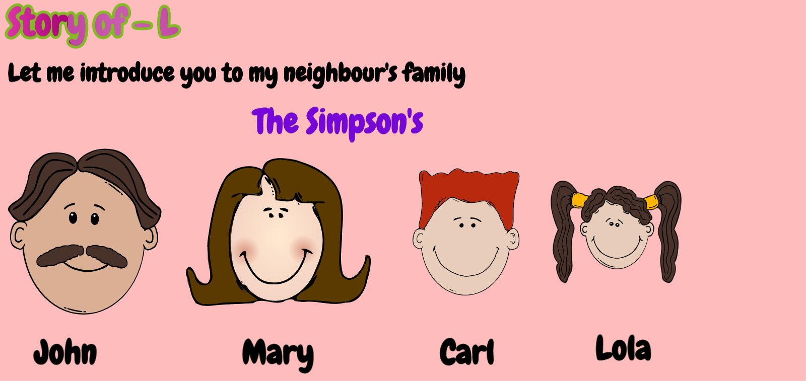
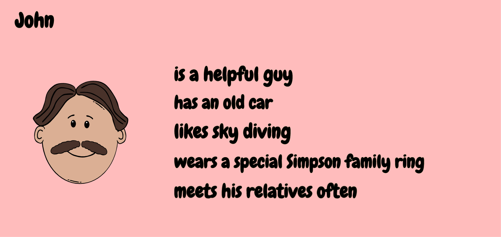
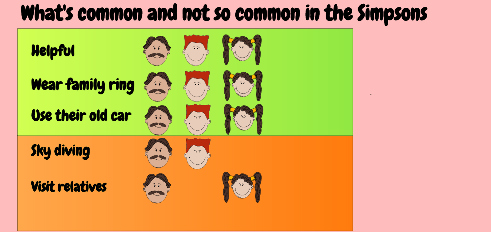
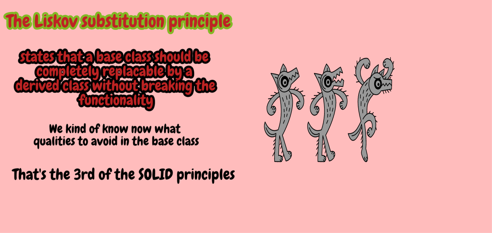

[Single Responsibility principle](https://github.com/raghuram-gs/SOLID_Principles/blob/master/SingleResponsibility.md)

[Open closed principle](https://github.com/raghuram-gs/SOLID_Principles/blob/master/OpenClosed.md)

[Interface seggregation principle](https://github.com/raghuram-gs/SOLID_Principles/blob/master/InterfaceSeggregation.md)

[Dependency Inversion principle](https://github.com/raghuram-gs/SOLID_Principles/blob/master/DependencyInversion.md)
