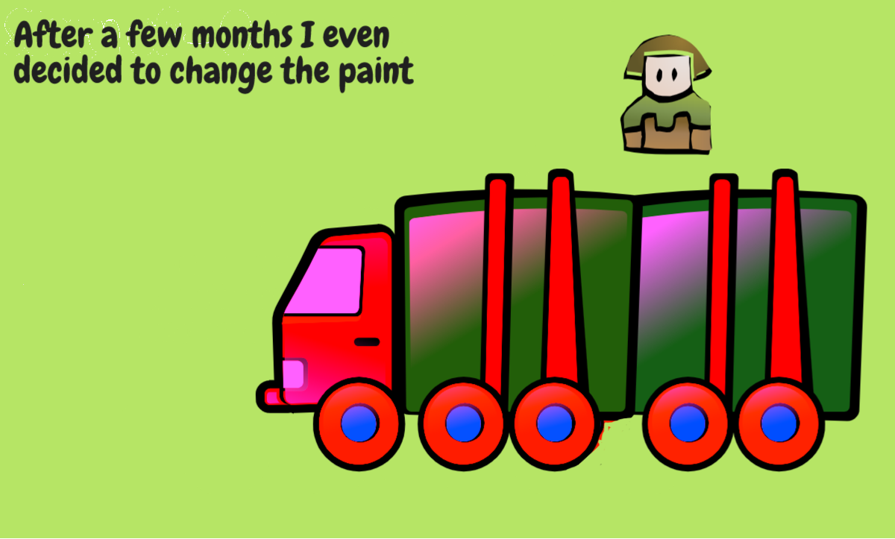
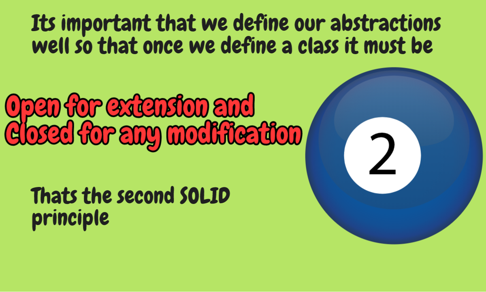

[Single Responsibility principle](https://github.com/raghuram-gs/SOLID_Principles/blob/master/SingleResponsibility.md)
[Liskov substitution principle](https://github.com/raghuram-gs/SOLID_Principles/blob/master/LiskovSubstitution.md)
[Interface seggregation principle](https://github.com/raghuram-gs/SOLID_Principles/blob/master/InterfaceSeggregation.md)
[Dependency Inversion principle](https://github.com/raghuram-gs/SOLID_Principles/blob/master/DependencyInversion.md)
